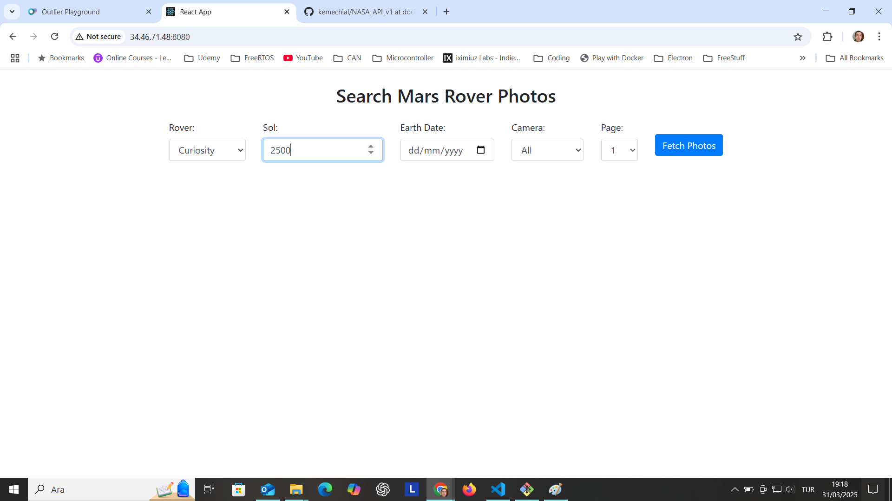
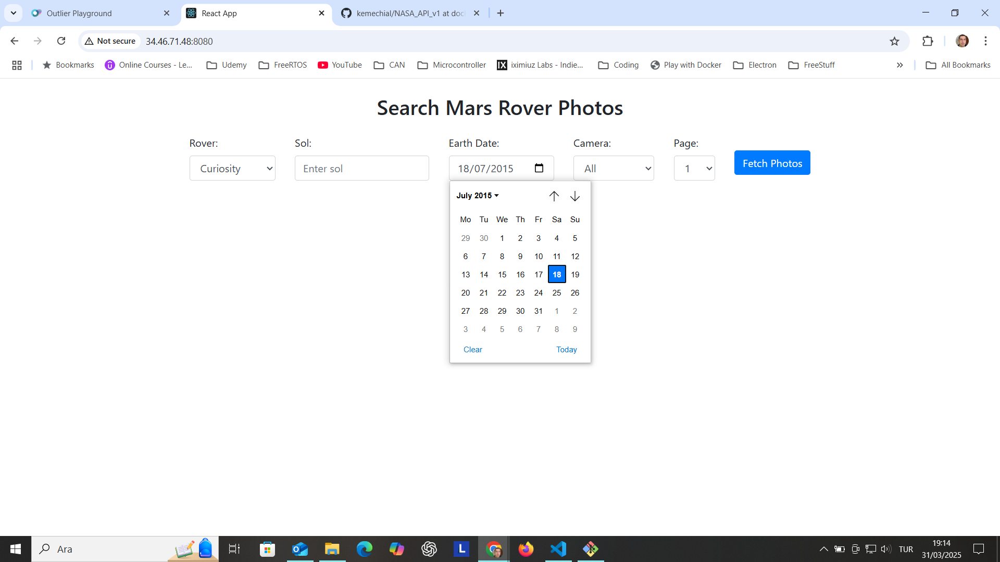
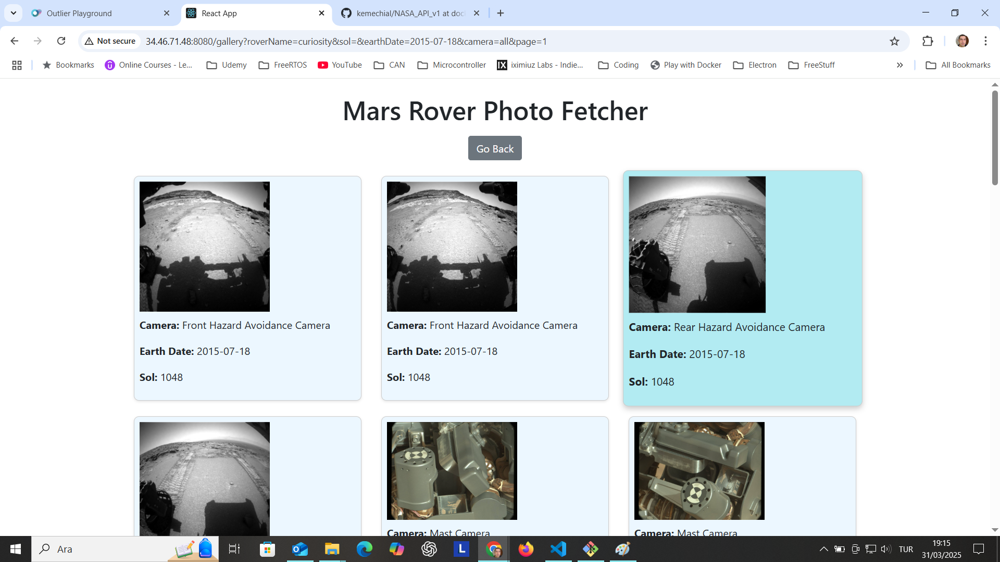
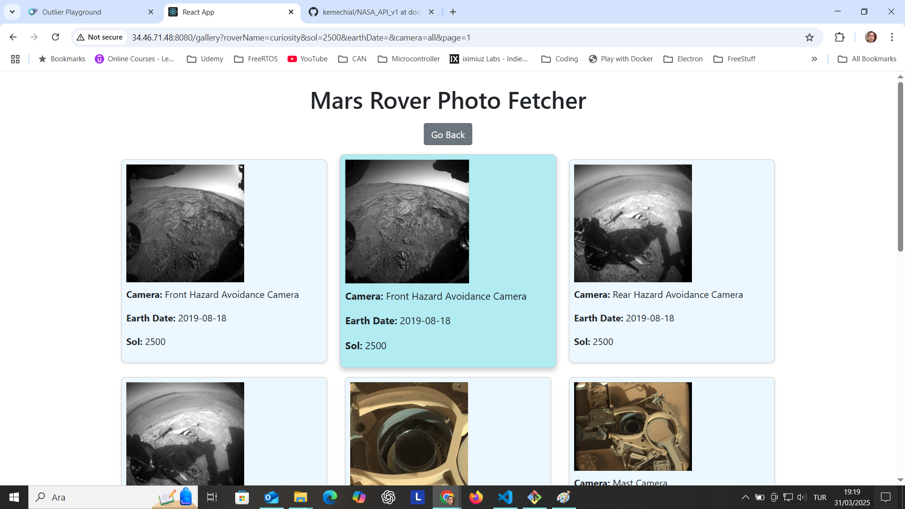
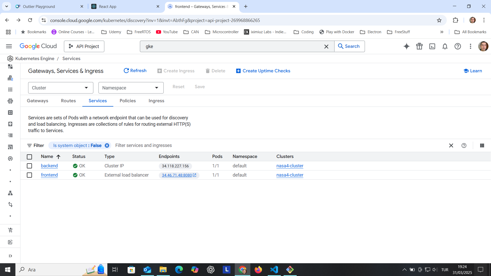

# GKE Cluster Web App - Harpoon

Welcome to the repository for the **Harpoon** web application, designed to run on Google Kubernetes Engine (GKE). This project demonstrates how to deploy a web application on a Kubernetes cluster using GKE. It is based on 
NASA API, which is queried by a Flask backend with the necessary API Key obtained from NASA Website. Key is injected into backend using .env file for dev environment and docker compose and kubelet secret for GKE cluster.
Using an input form, Mars Rover name and date can be selected. Either "Earth Date" or "Solar Mars Date" can be selected. 

# Solar Date Query
 


# Earth Date Query
 


## Overview

Harpoon is a simple web application that showcases the integration of a frontend with backend services, all orchestrated within a Kubernetes environment. 
The application is intended to serve as a learning tool for those interested in cloud-native technologies, particularly Kubernetes and GKE.
Docker images are created with Dockerfiles then pushed to Dockerhub for GKE deployment.

 

 

## Repository Structure


- **frontend**: Frontend code, using  framework React.
- **backend**: Backend services,  using  Python Flask.
- **Terraform_GCP**: Terraform files. 
- **Dockerfiles**: Dockerfiles for containerizing the application. 
- **README.md**: This file.

## Prerequisites

Before you begin, ensure you have the following installed:

- [Google Cloud SDK](https://cloud.google.com/sdk/docs/install)
- [Terraform](https://www.terraform.io/)
- [Docker](https://www.docker.com/)
- A Google Cloud Platform (GCP) account with billing enabled.
  Create a service account with necessary permissions, create an access key as json file and configure Terraform with this.

## Setup

### 1. Clone the Repository

```bash
git clone https://github.com/kaanevranportfolio/GKE-cluster-web-app_Harpoon.git
cd GKE-cluster-web-app_Harpoon

```

### 2. Set up with Terraform

System can be put into use by Terraform, with provisioning and remote execution, everything will be set up automatically.

```bash
cd Terraform_GCP
terraform apply

```

### 3. GKE Console

Finally the resulting cluster can be reviewed from console.

 


